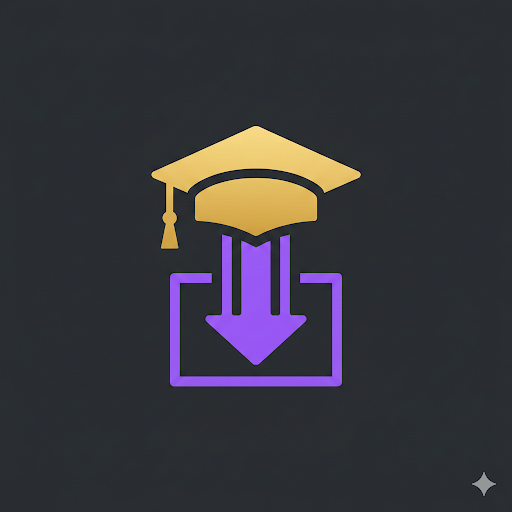

<div align="center">



# UNSW CSE Scraper


**批量下载 UNSW CSE 课程的 lecture slides、代码、tutorials、考试和 YouTube 录播**

通用知识库 + 自动化脚本，兼容任何 AI 编程助手


[English](README.md) | 简体中文

[功能](#功能) • [快速开始](#快速开始) • [课程列表](#公开-cgi-站点的课程) • [AI 部署](#部署到-ai-工具) • [贡献](#贡献)

---

</div>

## 功能

- **Lecture Slides** — 批量下载任何有 CGI 站的课程 PDF 课件
- **Lecture Code** — 每周源代码、starter files 和 solutions
- **Tutorials & Labs** — 保存所有题目页面为离线 HTML
- **Past Exams** — 收集历年试卷和 sample exam
- **YouTube Lectures** — 通过 yt-dlp 下载视频、纯音频 (MP3)、字幕
- **WebCMS3** — 使用浏览器 cookies 访问已注册课程资源
- **AI 工具兼容** — 将 `KNOWLEDGE.md` 作为任何 LLM 的知识库

## 原理

UNSW CSE 有两套独立系统：

| 系统 | URL | 认证 | 数据保留 |
|------|-----|------|----------|
| **CGI 站** | `cgi.cse.unsw.edu.au/~cs{code}/{term}/` | **无需登录** | 历史学期永久保留 |
| **WebCMS3** | `webcms3.cse.unsw.edu.au/COMP{CODE}/{term}/` | 需要 cookies | 仅当前学期 |

> CGI 站是 UNSW CSE 学院的**官方**课程网站，由 lecturer 维护。公开访问是刻意设计。

## 快速开始

```bash
# 克隆
git clone https://github.com/Genius-Cai/unsw-cse-scraper.git
cd unsw-cse-scraper

# 一键抓取课程 (无需登录)
./scripts/scrape.sh cs2521 26T1 ~/UNSW/COMP2521

# 下载 YouTube 录播
./scripts/download-videos.sh "PLAYLIST_URL" ~/UNSW/COMP2521/lectures/videos
```

### 输出目录结构

```
~/UNSW/COMP2521/
├── lectures/
│   ├── slides/          # PDF 课件
│   ├── code/            # 每周源代码 (含 solutions)
│   │   └── wk1-topic/
│   │       ├── all.zip
│   │       ├── solution/
│   │       └── starter/
│   ├── revision/        # 复习练习 zips
│   ├── videos/          # YouTube 录播 (yt-dlp)
│   └── audio/           # 纯音频 MP3 (通勤听课)
├── tutorials/           # Tutorial 题目 (HTML)
├── labs/                # Lab 题目 (HTML)
├── assignments/         # Assignment 规格 (HTML)
├── exams/               # 历年试卷 + sample exam
└── guides/              # Style guide, DSA 手册
```

## 公开 CGI 站点的课程

**2026 年 2 月验证**。以下课程无需登录即可访问：

| 课程 | 名称 | 可用学期 |
|------|------|----------|
| COMP1511 | 编程基础 | 26T1, 25T3, 25T1 |
| COMP1521 | 计算机系统基础 | 26T1, 25T3, 25T1 |
| COMP2041 | 软件构建 | 26T1, 25T1 |
| COMP2521 | 数据结构与算法 | 26T1, 25T3, 25T1 |
| COMP3131 | 编程语言与编译器 | 26T1, 25T1 |
| COMP3161 | 编程语言概念 | 25T3 |
| COMP3222 | 数字电路与系统 | 26T1, 25T1 |
| COMP3311 | 数据库系统 | 26T1, 25T1 |
| COMP3411 | 人工智能 | 26T1, 25T1 |
| COMP6080 | Web 前端编程 | 26T1, 25T3, 25T1 |
| COMP9024 | 数据结构与算法 (研究生) | 26T1, 25T3, 25T1 |
| COMP9311 | 数据库系统 (研究生) | 26T1, 25T3, 25T1 |
| COMP9315 | DBMS 实现 | 26T1, 25T1 |
| COMP9020 | 计算机科学基础 | 25T3 |
| COMP9242 | 高级操作系统 | 25T3 |
| COMP9334 | 容量规划 | 25T1 |

<details>
<summary><b>没有 CGI 站的课程</b> (仅 WebCMS3，需要注册)</summary>

COMP1531, COMP2121, COMP2511, COMP3141, COMP3153, COMP3211, COMP3231,
COMP3331, COMP3421, COMP3900, COMP4336, COMP4511, COMP6443, COMP6451,
COMP6452, COMP9319, COMP9417, COMP9444, COMP9517

</details>

## WebCMS3 访问

适用于已注册课程或没有 CGI 站的课程：

1. 安装浏览器扩展 [Get cookies.txt LOCALLY](https://chromewebstore.google.com/detail/get-cookiestxt-locally/cclelndahbckbenkjhflpdbgdldlbecc)
2. 登录 [webcms3.cse.unsw.edu.au](https://webcms3.cse.unsw.edu.au)
3. 导出 cookies → 保存为 `~/UNSW/cookies.txt`
4. 使用: `curl -b ~/UNSW/cookies.txt "https://webcms3.cse.unsw.edu.au/COMP2521/26T1/"`

## YouTube 录播下载

```bash
brew install yt-dlp  # macOS
pip install yt-dlp    # 或 pip

# 列出 playlist 内容
yt-dlp --flat-playlist --print "%(playlist_index)s. %(title)s" "PLAYLIST_URL"

# 下载视频 (1080p)
./scripts/download-videos.sh "PLAYLIST_URL" ~/UNSW/COMP2521/lectures/videos video

# 仅音频 (MP3，适合通勤)
./scripts/download-videos.sh "PLAYLIST_URL" ~/UNSW/COMP2521/lectures/audio audio

# 同时下载视频+音频
./scripts/download-videos.sh "PLAYLIST_URL" ~/UNSW/COMP2521/lectures/videos both
```

## 部署到 AI 工具

将 `KNOWLEDGE.md` 作为通用知识库加载到任何 AI 助手中：

| 平台 | 指南 | 方式 |
|------|------|------|
| **Claude Code** | [deploy-claude-code.md](docs/deploy-claude-code.md) | 复制到 `~/.claude/skills/` |
| **Codex CLI** | [deploy-codex.md](docs/deploy-codex.md) | 添加为 `AGENTS.md` |
| **Gemini** | [deploy-gemini.md](docs/deploy-gemini.md) | 系统指令 |
| **ChatGPT** | [deploy-chatgpt.md](docs/deploy-chatgpt.md) | 自定义 GPT 或文件上传 |
| **Cursor / Windsurf** | [deploy-cursor.md](docs/deploy-cursor.md) | `.cursorrules` 文件 |

## 常见问题

| 问题 | 解决方案 |
|------|----------|
| CGI 返回 403 | 该资源有权限保护 (labs, exams, autotest) |
| WebCMS3 返回 404 | 过去学期已删除，只保留当前学期 |
| 找不到 slides | 路径因 lecturer 而异 — 脚本自动尝试 5 种常见路径 |
| 目录为空 | 学期刚开始，内容逐步上传。试试上一学期 |
| yt-dlp 失败 | 尝试 `--cookies-from-browser chrome` 处理非公开视频 |
| Cookie 过期 | 从浏览器重新导出。`remember_token` 有效期约 1 年 |

## 贡献

欢迎贡献！特别是：

- **发现新课程** — 找到了未列出的 CGI 站？提交 PR！
- **更新 slide 路径** — Lecturer 每学期可能会改路径
- **脚本改进** — 更好的错误处理、新功能
- **更多 AI 平台指南** — 其他工具的部署文档

```bash
fork → edit → PR
```

## 作者

**Steven Cai** ([@Genius-Cai](https://github.com/Genius-Cai))

UNSW 计算机科学

## 协议

[MIT](LICENSE)
